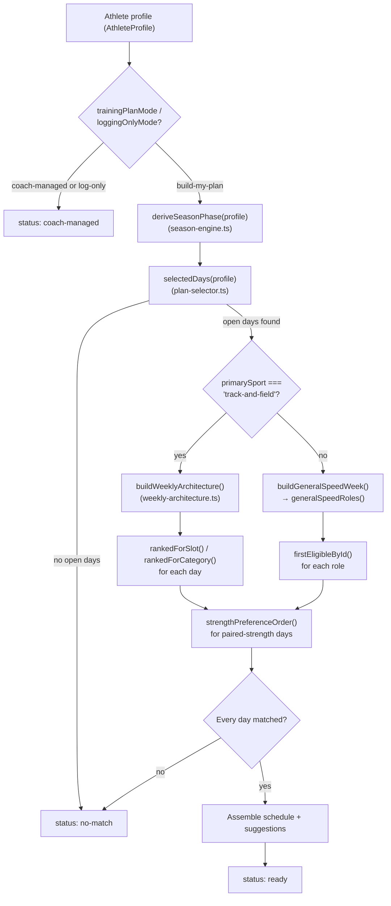

# SprintLab Plan Engine Guide

**Status:** living document — keep it accurate as the engine changes (see [§20 Maintenance](#20-maintenance-instructions)).
**Last verified against code:** August 21, 2026, commit `c28df8e` (uncommitted working-tree state at time of writing includes no plan-engine changes since that commit).
**Audit command:** `node --experimental-strip-types --loader ./scripts/alias-loader.mjs ./scripts/audit-plan-engine.ts`
**Regression command:** `node --experimental-strip-types --loader ./scripts/alias-loader.mjs ./scripts/verify-plan-engine-audit-regressions.ts`
**Owner:** SprintLab engineering (no named individual owner recorded at time of writing — assign one).

This is not a QA report. [PLAN_ENGINE_QA_REPORT.md](../PLAN_ENGINE_QA_REPORT.md) is the point-in-time audit that found and fixed specific bugs; this document is the standing explanation of how the engine works today, for anyone — athlete, parent, coach, tester, designer, or engineer — who needs to understand it.

---

## 1. Executive summary

SprintLab's **plan engine** is the part of the app that builds an athlete's weekly training schedule — which days they train, what workout happens on each day, and which strength session is paired with it. It lives mainly in one file, [`utils/plan-selector.ts`](../utils/plan-selector.ts), and its single entry point is one function: `buildDeterministicWeeklyPlan(profile, workouts)`.

**It is deterministic, not AI-generated.** Given the same athlete profile and the same workout library, it always produces the same week. No large language model is involved in choosing what training happens — the engine picks from a fixed catalogue of human-authored, reviewed ("Approved") workouts using a set of coded rules. Gemini (SprintLab's AI layer, branded "Coach" or "Split" in the app) is a completely separate system that talks *about* the plan and can propose small, bounded edits to it — it does not write the plan from scratch, and it has no code path that lets it invent a workout that isn't already in the library.

**What it uses:** the athlete's sport, primary event (for track), experience level, how many days a week they want to train, which weekdays are already taken by rest, team practice, another sport, or a game/competition, and (for track) a season calendar. A number of other things the athlete enters during onboarding — improvement priorities, equipment/facility access, season phase — are currently stored but do **not** change the starting week. That is disclosed honestly in this guide rather than glossed over.

**What it produces:** for each available training day, one primary workout (pulled from the authored library, never invented), often paired with one strength session on the same day, plus an explanation of why that workout fits, what harder options were deliberately excluded, what equipment/surface it needs, a safety stop-rule, and up to two swappable alternatives. Days that aren't training days come back as an honest "Rest day" or "Open / existing training" — never a fake filled-in session.

**The most important safety/quality constraint:** the engine will refuse to guess. If it cannot find a properly reviewed ("Approved") workout that fits every hard requirement for a day, it returns a `no-match` result and says so explicitly — it never fills a gap with an unreviewed or badly-fitting session (§16). A second, separate safety layer — daily readiness check-ins, not covered by this guide — can restrict or block a workout on the day of, independent of what the plan engine scheduled.

**What Gemini/Coach currently does and does not control:** Coach can read the current plan and athlete data to answer questions, and can propose a small set of bounded edits (move a workout, replace it with another Approved library record, adjust volume within a safe range, add a recovery day) that the athlete must review and approve before anything changes. Coach **cannot** generate a workout that doesn't exist in the library, and does not run the deterministic selection algorithm described in this guide — that logic is fixed, reviewable TypeScript, not a model output.

---

## 2. What "deterministic" means

**Same inputs → same output, every time.** If two athletes (or the same athlete twice) have identical profiles — same sport, event, experience, schedule, and season status — `buildDeterministicWeeklyPlan()` returns byte-for-byte the same plan. There's no randomness, no model sampling, and no hidden state. This is testable directly: [`scripts/audit-plan-engine.ts`](../scripts/audit-plan-engine.ts) calls the real function 390 times with different onboarding combinations and records the exact result each time, and [`scripts/verify-plan-engine-audit-regressions.ts`](../scripts/verify-plan-engine-audit-regressions.ts) re-asserts specific invariants automatically as regression tests.

**Workouts come from the approved SprintLab workout library**, not from anywhere else. Every session in a generated plan is one specific, human-authored record from [`data/workout-library.ts`](../data/workout-library.ts) — the same catalogue an athlete can browse directly in the app's Library tab. The engine's job is *selecting* the right existing record for each day, never *writing* a new one.

**Why determinism matters here, concretely:**
- **Reliability** — an athlete's plan doesn't change unpredictably between sessions of using the app; a rebuild with the same profile produces the same recommendation.
- **Testability** — the whole 390-combination audit in §15/§17 would be meaningless against a system that could answer differently each time.
- **Explainability** — every suggested day carries a `whyThisFits` list and a `harderOptionsExcluded` list (both real fields on `SuggestedPlanDay`, not generated copy) that trace directly back to the rule that picked it. A support engineer, a coach, or the athlete can always ask "why this workout" and get a real, code-backed answer rather than a plausible-sounding guess.

**Where AI may eventually assist without replacing the engine:** per [`SPRINTLAB_AI_CONTEXT.md`](../SPRINTLAB_AI_CONTEXT.md)'s "Deterministic planner vs. AI" section, the deterministic planner is meant to stay the reliable baseline. Gemini/Coach is intended to reason *beyond* it when athlete-specific context justifies a deviation (a missed week, unusual schedule change, a specific athlete question) — but any such deviation is expected to be explainable and grounded in real SprintLab data, applied only through the same bounded proposal mechanism described in §1, never as a silent rewrite of the algorithm itself.

---

## 3. Inputs and outputs

### Athlete inputs

| Input (profile field) | Where it's set | Currently affects the starting week? |
|---|---|---|
| Primary sport (`primarySport`/`sport`) | Onboarding | **Yes** — routes to the track pathway (§5) or the shared general-speed pathway; football gets its own sub-branch within general-speed. |
| Track primary event (`primaryEvent`) | Onboarding | **Yes**, for track athletes — determines the event tag and short-vs-long-sprint pathway (`profileEvent()`/`profilePathway()`). |
| General-speed pathway (implied by sport, not separately asked) | Derived | **Yes** — football vs. every other non-track sport (§5). |
| Experience level (`experienceLevel`) | Onboarding | **Yes** — mapped to a library tier (`profileLevel()`, §7) that changes both which workouts are eligible and which strength records are preferred. |
| Requested training days (`trainingDaysPerWeek`) | Onboarding | **Yes** — sets how many days get scheduled (`selectedDays()`), capped 1–5. |
| Available weekdays (`availableTrainingDays`) | Onboarding/Settings | **Yes**, when explicitly set — used as the exact day list instead of a default pattern. |
| Preferred rest day (`preferredRestDay`) | Onboarding | **Yes** — blocked from scheduling. |
| Sport-practice days (`sportPracticeDays`) | Onboarding | **Yes** — blocked from scheduling. |
| Other-sport days (`otherSportDays`) | Onboarding | **Yes** — blocked from scheduling. |
| Competition/game days (`gameOrCompetitionDays`) and season-calendar priority meets | Onboarding/Settings | **Yes** — blocked from scheduling if within 6 days; priority meets also narrow which *type* of workout is safe near a meet (`meetWindowAllowsWorkout()`, §13). |
| Equipment/facility access (`weightRoomAccess`, `homeEquipment`, etc.) | Onboarding (historically) | **No.** Collected and stored, fully preserved in the profile, but base-plan generation does not read it (§9, §17). A no-equipment profile and a fully-equipped profile produce the byte-identical plan — this is asserted by an automated regression test, not incidental. |
| Injury/pain/return-to-training restrictions (`currentPain`, `trainingContext === 'return-to-training'`) | Onboarding/Settings | **Yes, but only for the general-speed pathway** — regresses the selected difficulty tier by one step (`adjustedGeneralSpeedTier()`, §7). Track-pathway generation does not currently read these fields the same way. |
| Improvement priorities (`speedGoals`, `raceDevelopmentAreas`) | Onboarding | **No**, not in any way an athlete would notice. Stored, shown to Coach, and used as a same-category tiebreak worth roughly 10 of ~100 ranking points on the track pathway only — which never actually changes the outcome, because in practice there's only one eligible candidate per category/event/phase slot. See §11 for the full honest breakdown. |
| Season calendar / derived phase (`seasonCalendar`, `deriveSeasonPhase()`) | Onboarding/Settings | **Partially.** The derived phase is computed and still narrows workout choice near an upcoming meet (`meetWindowAllowsWorkout()`), but it no longer gates which *architecture* (slot sequence) is used — every plan is currently built as if it were `general-preparation` (`MVP_GENERATION_PHASE`, §12). This is an explicit, disclosed MVP simplification, not a bug. |

### Generated output

Each scheduled day is a `SuggestedPlanDay` (type defined in [`utils/plan-selector.ts`](../utils/plan-selector.ts)) containing:

- **`dayIndex`** — which weekday (0 = Sunday … 6 = Saturday).
- **`workoutId`** / **`plannedWorkout`** — the chosen library workout, converted into the app's in-session `PlannedWorkout` shape via `libraryWorkoutToPlannedWorkout()`.
- **`supportWorkoutIds`** — the paired strength record's ID, if this day pairs strength (§6, §9).
- **`weeklyRole`** / **`loadClass`** ('high' | 'moderate' | 'low') / **`targetCategory`** — the slot this day fills in the weekly architecture (§6).
- **`whyThisFits`** — an array of real, code-generated explanation strings (not decorative copy).
- **`harderOptionsExcluded`** — what was deliberately left out and why.
- **`requiredSetup`** — the workout's surface and equipment, read plainly from the record (§17 — this used to be experimentally tied to the athlete's stored equipment answers; that was reverted because those answers aren't collected by any current onboarding question, so the text is now the same for every athlete, honestly).
- **`stopRule`** — the workout's first authored safety note.
- **`alternatives`** — up to two other eligible workouts the athlete could swap in, each a real candidate that passed the same hard gates.

A day with nothing scheduled comes back as a `ScheduledDay` with `kind: 'rest'` and one of two honest titles: **"Rest day"** (an athlete's own chosen non-training day) or **"Open / existing training"** (a day already taken by practice, another sport, or a competition — `restDay()`'s `hasExternalCommitment` check).

**Status and fallback behavior** — `WeeklyPlanSuggestion` is one of four outcomes:
- `ready` — a full week was built; includes the `schedule`, `suggestions`, a plain-language `summary`, and `warnings`.
- `coach-managed` — the athlete's `trainingPlanMode` is `'log-coach-plan'` or `loggingOnlyMode` is on; the engine deliberately does not generate anything and says so.
- `no-match` — no safe, complete week could be assembled; see §16 for exactly what triggers this and why it's now rare.
- `unsupported-sport` — declared in the type but never actually returned by any code path today (§17, a known dead status).

---

## 4. Plan-generation pipeline



Step-by-step (track and general-speed pathways share steps 1–2 and diverge at step 3):

1. **Mode gate.** `buildDeterministicWeeklyPlan()` first checks `profile.loggingOnlyMode` and `profile.trainingPlanMode === 'log-coach-plan'`. If either is true, it returns `coach-managed` immediately — no generation happens at all. *File:* `utils/plan-selector.ts`. *Function:* `buildDeterministicWeeklyPlan`.
2. **Season phase (computed, not yet gating).** `deriveSeasonPhase(profile)` (`utils/season-engine.ts`) turns the athlete's season calendar into one of 6 `LibrarySeasonPhase` values or `'needs-calendar'`. This result is kept and used later for meet-proximity safety narrowing and the summary text — it does not block generation (§12).
3. **Usable training days.** `selectedDays(profile)` computes which weekdays are actually open: it starts from `availableTrainingDays` if explicitly chosen, or a default pattern sized to `trainingDaysPerWeek`, then removes the preferred rest day, sport-practice days, other-sport days, and any competition within 6 days. *Rejection cause:* if zero days remain open, the whole result is `no-match` ("No open speed-training day").
4. **Pathway split.** If `primarySport` isn't `'track-and-field'`, everything from here happens inside `buildGeneralSpeedWeek()` instead of the track branch — see §5 for what differs.
5. **(Track) Weekly architecture.** `buildWeeklyArchitecture({ event, phase, level, sessionCount })` (`utils/weekly-architecture.ts`) returns a fixed sequence of "slots" for the given phase (always `general-preparation` under the current MVP, see §12), trimmed to the requested day count via `spreadSlots()`. Each slot names a target category, a load class, and a rationale string.
6. **(Track) Candidate search per slot.** For each slot, `rankedForSlot()`/`rankedForCategory()` filters the whole approved library down to workouts that pass `hardGateMatch()` (§13) for that slot's category (or its listed alternatives), then scores and sorts the survivors. *Rejection causes:* wrong event tag, wrong pathway, wrong athlete level, wrong season phase, blocked by `logisticsMatch()` (only genuinely specialized equipment like a towing system or force plate can reject a workout — ordinary equipment/facility answers cannot, §9/§17), too close to a priority meet for its category (`meetWindowAllowsWorkout()`), or already used earlier in the week.
7. **(General-speed) Role-based lookup.** `generalSpeedRoles()` returns a fixed list of roles for the athlete's day count/sport/level, and `firstEligibleById()` picks the first workout in each role's preferred-ID list that's eligible — a straight lookup, not a scored ranking (§5, §11).
8. **Strength pairing.** Where a slot/role calls for it, `strengthPreferenceOrder(level, purposeSlot)` returns an ordered ID list (§9) and the same `firstEligibleById`/`rankedForSlot` machinery picks the best available match, excluded from being the same record as the primary workout.
9. **Verification / assembly.** If any day's search comes back empty, that day's reason is collected; if there are *any* failures, the whole result becomes `no-match` (deliberately all-or-nothing — the engine will not deliver a plan with an invented or missing day). Otherwise, each `SuggestedPlanDay` is assembled with its explanation text, and the remaining weekdays are filled in as `restDay()` entries.
10. **Return.** The completed `schedule` (all 7 days, workout or rest), the `suggestions` array, a plain-language `summary`, and `warnings` are returned as `status: 'ready'`.

---

## 5. Pathways

SprintLab currently has one fully event-specific pathway (track) and one shared, disclosed-generic pathway used by every other sport (with a football-specific sub-branch inside it).

### 60m/100m — short sprint

- **Emphasis:** first-30m acceleration, drive-phase mechanics, upright top speed at shorter distances.
- **Classification:** `profilePathway()` maps `60m`/`100m` to `'short-sprint-100-200'`.
- **ID families used:** `ACC-*` (acceleration), `MAX-*` (maximum velocity), `TEM-*` (tempo), `SED-*` (speed endurance), `STR-*` (paired strength) — using each family's *short-sprint*-preferred variant (e.g. `ACC-03`, `MAX-02`, `TEM-01`, `SED-01`) rather than the long-sprint variant.

### 200m/400m — long sprint

- **Emphasis:** the same acceleration/max-velocity foundation, plus curve running (200m) and longer speed-endurance/special-endurance work as the athlete's phase allows.
- **Classification:** `profilePathway()` maps both `200m` and `400m` to `'long-sprint-200-400'`. This is the pathway the **200m correction** (§10) made the *architecture layer* actually respect — before the fix, 200m silently used 100m's exact workout selections despite already being classified with 400m at the eligibility-filter level.
- **ID families used:** the same families, but the long-sprint-preferred variant of each — `ACC-04`/`ACC-06`, `MAX-05`/`MAX-04`, `TEM-02`, `SED-04`/`SED-03`, and (in later phases only, currently unreachable under the MVP phase pin — §12) `SPE-*` special-endurance records and `STA-02` (curve start).

### Football — 40-yard-style speed pathway

- **Emphasis:** short-area acceleration and the 20–40-yard upright-speed segment, framed around 40-yard-dash-style testing language rather than track race distances.
- **Classification:** inside `buildGeneralSpeedWeek()`, gated by `sport === 'football'` — a boolean, not a distinct pathway type.
- **ID family used:** `F40-*` (e.g. `F40-ACC-01/02/03`, `F40-MAX-01/02/03`, `F40-TRANSFER-01`) — tiered by `tierSuffix` (`01` foundation, `02` trained, `03` advanced), the only sport-specific ID family outside track.

### General-speed pathway — basketball, soccer, baseball/softball, lacrosse, rugby, "general athletic performance," and "other"

- **Emphasis:** a linear-speed foundation (acceleration → upright speed → light integration) intended to transfer to any field/court sport, not a sport-specific movement pattern.
- **Classification:** every non-track, non-football sport shares `generalSpeedRoles()`'s non-football branch. `generalSpeedTier()`/`tierSuffix` still applies (foundation/trained/advanced), but there is no sport-identity branch beyond "is it football."
- **ID family used:** `GEN-*` (e.g. `GEN-ACC-01/02/03`, `GEN-MAX-01/02/03`, `GEN-LOW-01`, `GEN-INTEGRATE-01`, `GEN-MICRO-01`, `GEN-COURT-ACC-01`).

**This is explicitly disclosed, not hidden:** basketball, soccer, baseball/softball, lacrosse, rugby, and "general athletic performance"/"other" athletes all currently receive the *same* generic general-speed plan — confirmed directly by the audit (`PLAN_ENGINE_QA_REPORT.md`'s Critical #3: at a representative config, soccer, basketball, baseball, general, and "other" produced byte-identical weeks). The corrections pass explicitly kept this as-is, calling it intentional and disclosed for the MVP, not a bug to fix (§17).

### Day-count assembly

For track, `spreadSlots()` picks a fixed subset of the phase's 5-slot architecture by day count:

| Day count | Slots used (track, general-preparation) |
|---|---|
| 1 | Acceleration + strength only |
| 2 | Acceleration + strength, Maximum velocity + strength |
| 3 | Acceleration + strength, Tempo/capacity, Maximum velocity + strength |
| 4 | Acceleration + strength, Tempo/capacity, Maximum velocity + strength, Technical low day |
| 5 | All 5 slots (adds Speed endurance / sprint quality — or, for a beginner, an Elastic power foundation day instead) |

For general-speed, `generalSpeedRoles(sessionCount, ...)` is its own hand-written branch per day count (1–2, 3, 4, and 5 — with a level-dependent 5th role, §7) rather than a slice of a longer list.

### Shared across all pathways

- Only `approved` library workouts are ever selected (`isRecommendationEligible`).
- No workout ID repeats within a week.
- High-intensity days are never scheduled back-to-back in the produced sequence.
- Strength is paired on exactly two high-output days per week (the acceleration day and the max-velocity day), never as a standalone strength-only day, under the current MVP architecture.
- Every day carries the same explanation/safety/alternatives shape regardless of pathway.

### What the current library does not yet support

- A dedicated 200m architecture distinct from 400m's (§10) — 200m currently shares the long-sprint architecture with 400m rather than having its own.
- Sport-specific movement patterns for basketball/soccer/baseball beyond the shared general-speed foundation (no change-of-direction, reactive-agility, or sport-skill prescriptions are wired into automatic generation — `harderOptionsExcluded` says this outright: *"Change-of-direction and sport-skill prescriptions are excluded until dedicated sport pathways are reviewed."*).
- Phase-specific architecture for any pathway under the current MVP pin (§12) — the `specificPreparation()`/`preCompetition()`/`competition()`/`taper()`/`transition()` functions exist in `weekly-architecture.ts` and are fully written, just unreachable from the live generation path today.

---

## 6. Weekly architecture and high/low organization

A **session "slot"** is one named role in the week — e.g. *"Acceleration + strength"* or *"Extensive tempo / capacity"* — carrying a load class, a target workout category, a short list of acceptable alternative categories, an ordered list of preferred workout IDs, whether it pairs strength, and a plain-language rationale. `WeeklyArchitectureSlot` (`utils/weekly-architecture.ts`) is the type; `generalPreparation()`, `specificPreparation()`, `preCompetition()`, `competition()`, `taper()`, and `transition()` are the phase-specific functions that build a 5-slot list (only `generalPreparation()` is reachable under the current MVP, §12).

**High vs. low:** each slot is `loadClass: 'high' | 'moderate' | 'low'`. High days target acceleration, maximum velocity, or speed-endurance categories — genuine quality sprint work. Low days always target `tempo-recovery` (hardcoded in the `low()` builder function) — extensive, lower-intensity work, never a second hard sprint session in disguise.

**Why consecutive high days are avoided:** the fixed slot sequence alternates high/low/high/low/high by construction (§5's day-count table) — the architecture itself interleaves load classes rather than leaving it to chance, and this is one of the properties directly asserted by an automated test (`verify-plan-engine-audit-regressions.ts` — "no consecutive high-intensity days, across all 6 phases").

**Why more available days doesn't mean more sprinting:** at 5 days, a beginner or developing athlete's 5th slot becomes a lower-complexity plyometric/elastic day (`generalSpeedRoles`'s foundation/developing branch) or (`generalPreparation()`'s beginner override) a moderate-load elastic-power day rather than a third demanding sprint exposure — an explicit design decision, not an oversight, with its own rationale string: *"Newer athletes use the fifth day for movement quality instead of receiving a third demanding sprint exposure."*

**How rest days and other commitments affect placement:** `selectedDays()` (§4 step 3) removes the preferred rest day, practice days, other-sport days, and near-term competition days *before* the architecture is ever applied — the slot sequence is laid onto whatever days remain, in weekday order, never onto a blocked day.

**Two-day vs. five-day plans, structurally:** a 2-day plan is just the first two slots of the same 5-slot sequence (acceleration+strength, then maximum-velocity+strength) — not a differently-designed "mini" plan. A 5-day plan adds the tempo/technical-low day and either a speed-endurance day (or, for a beginner, the elastic-power day) on top. This is a genuine structural difference in *content*, not merely more of the same two sessions repeated.

**How strength is paired:** exactly two slots per week carry `pairStrength: true` — the acceleration slot and the maximum-velocity slot, always in that order. The engine tracks a `purposeSlot` ordinal (0 for the first pairing this week, 1 for the second) so `strengthPreferenceOrder()` (§9) knows which "purpose" (force vs. explosive) it's filling, independent of which literal weekday it lands on.

**When the requested weekday arrangement can't be used exactly:** `selectedDays()` first honors an explicitly chosen `availableTrainingDays` list if the athlete set one; otherwise it starts from a `defaultDayPatterns` template sized to `trainingDaysPerWeek` (e.g. 3 days → Mon/Wed/Fri) and, if any of those default days are blocked, fills in the next open weekday in calendar order instead of simply reducing the day count.

**Research tie-in:** the guide's evidence trail for these principles is the internal research document [`knowledge/SprintLab_Workout_Library_and_Season_Engine_V3.pdf`](../knowledge/SprintLab_Workout_Library_and_Season_Engine_V3.pdf) (also at [`docs/v3/SprintLab_Workout_Library_and_Season_Engine_V3.pdf`](../docs/v3/SprintLab_Workout_Library_and_Season_Engine_V3.pdf)), the source document behind the current 70-record workout catalogue and its category/phase/level tagging. This guide does not restate that document's internal contents beyond what's already reflected in the code and the `sources: [...]` citations on individual workout records (§19) — see the evidence-gap note there.

---

## 7. Experience-level progression

`AthleteExperienceLevel` (the profile's stored value) has 5 possible values; `LibraryAthleteLevel` (the workout library's tier) has 4. `profileLevel()` (`utils/plan-selector.ts`) maps between them:

| Stored `experienceLevel` | Onboarding label | Mapped `LibraryAthleteLevel` |
|---|---|---|
| `beginner` | "Just starting" | `foundation` |
| `developing` | (intermediate-adjacent) | `developing` |
| `intermediate` | "Consistent training" | `trained` |
| `advanced` | "Experienced" | `advanced` |
| `elite` | *not offered by any onboarding UI* | `advanced` (falls through `profileLevel`'s final `return 'advanced'`) |

Note from the audit (`PLAN_ENGINE_QA_REPORT.md` M6): `elite` is a valid stored value in the type but `ExperienceStep`'s onboarding options never offer it — it's reachable only if set programmatically (e.g. directly editing stored data), not through the real onboarding flow.

**What experience is allowed to change today:**
- **Eligible workout records** — every library workout's `athleteLevels` array is a hard gate (`hardGateMatch()`/`firstEligibleById()`); a workout not tagged for the athlete's mapped level is never selected, full stop.
- **Strength selection** — foundation/developing get `STR-01`(force)/`STR-02`(explosive); trained/advanced get the more specialized `STR-04`(posterior-chain)/`STR-05`(unilateral) as their primary pick (§9). Confirmed by a fresh run of the 390-combination audit: `STR-04`/`STR-05` selected in exactly 310 of 390 `ready` runs, 100% of `intermediate`/`advanced` runs and 0% of `beginner`/`developing` runs — a clean tier split, not an accidental skew.
- **Day-5 role selection** (general-speed pathway) — foundation/developing get an elastic-movement/plyometric 5th day; trained/advanced get a 5th "integration" quality-sprint day (§6).
- **Specific workout IDs within a category** — e.g. `MAX-01` (foundation-appropriate) vs. `MAX-03` ("Fly 30 Advanced Quality," `levels: ['advanced']` only) — different records within the same maximum-velocity category, gated by `athleteLevels`.

**What experience does not automatically mean:** per the audit's Medium #3, every level *does* select genuinely distinct workout IDs, but the *estimated total weekly duration* barely moves (e.g. a 100m 4-day plan: 344 min/week for beginner vs. 356 min/week for advanced — about 3.5% difference at time of the original audit). Advanced programming is not simply "the same session but longer" — the differentiation is mostly in which specific authored record gets picked (different technical demand, different volume/intensity as written into that record's own prescription), not in a headline duration number an athlete would notice at a glance. This guide states that plainly rather than implying advanced plans are dramatically bigger.

**Concrete example (from a real run — see §15 Example 3 vs. 3b):** an intermediate-mapped-to-`trained` athlete's acceleration+strength day pairs `STR-04` ("Posterior Chain + Lower-Leg Strength"); a beginner-mapped-to-`foundation` athlete's equivalent day (§15 Example 1) pairs `STR-01` ("Force-Oriented Sprint Strength") — a real, verifiable difference in which authored session is prescribed.

---

## 8. Workout-library taxonomy

The 70-record catalogue in [`data/workout-library.ts`](../data/workout-library.ts) is authored content with lifecycle metadata, not a random list. Every record has an `approvalStatus` (`approved` | `draft` | `archived`) — the deterministic selector only ever considers `approved` records (`isRecommendationEligible()`), `athleteLevels`, `seasonPhases`, event/pathway tags, `equipmentRequired`/`equipmentOptional`, and a `surface` requirement.

**Current catalogue composition** (freshly counted from the source file, not the older `PLAN_ENGINE_QA_REPORT.md`/`PROJECT_CONTEXT.md` figures, which predate later additions): **70 total records — 64 approved, 4 draft, 2 archived.**

| Prefix | Full category | Typical placement | Pathways/events | Intensity | Example approved records | Restrictions |
|---|---|---|---|---|---|---|
| `ACC` | Acceleration | High-output day, paired with strength | Short + long sprint (shared, some hill/long-sprint-specific) | High | `ACC-01` Wall Drill + 10m Start Foundation, `ACC-04` Short Hill Acceleration | `ACC-04` requires `hill` surface |
| `STA` | Starts | Pre-competition high day; short-sprint focus | 60m–400m (`STA-02` curve start is long-sprint only) | High | `STA-01` Block Start Setup + 10-20m | Requires starting blocks |
| `MAX` | Maximum velocity | High-output day, paired with strength | Short + long sprint | High | `MAX-01` Wicket Rhythm + Fly 10, `MAX-05` Curve-to-Straight Fly 20 (long-sprint) | `MAX-03`/`MAX-05` are level/pathway-restricted |
| `SED` | Speed endurance | High day, general/specific preparation | Short + long sprint | High | `SED-01` Two Sets of 3×60m, `SED-04` 3×120m Relaxed Fast | Phase-restricted on several records |
| `SPE` | Special endurance | Late-phase, advanced long-sprint only | 400m primarily | High | (currently unreachable under the MVP phase pin, §12) | `specific-preparation`/`pre-competition` phases, advanced-only |
| `TEM` | Tempo / recovery | Low day | Shared | Low | `TEM-01` Grass 10×100m Extensive Tempo, `TEM-03` Technical Low Day + Strides | — |
| `STR` | Strength | Paired with a high-output sprint day | Shared | Moderate | `STR-01` Force-Oriented, `STR-04` Posterior Chain (§9) | Some require weight-room equipment; `STR-03` is the no-gym option |
| `PLY` | Plyometrics | Beginner/developing 5th-day, or moderate role | Shared | Moderate | `PLY-01`, `PLY-07` | — |
| `CORE` | Core / bodyweight | Low/support day | Shared | Low | `CORE-01`, `CORE-02` Bodyweight Athletic Basics | — |
| `TST` | Testing | Performance testing | Shared | Varies | — | Not part of the standard weekly rotation |
| `MEET` | Meet preparation | Competition-phase primer (currently unreachable, §12) | Shared | Moderate | — | `competition`/`taper` phases only |
| `GEN` | General-speed (non-football) | Full role set for basketball/soccer/baseball/general/other | General-speed pathway | High/low per role | `GEN-ACC-02`, `GEN-MAX-02`, `GEN-LOW-01` | — |
| `F40` | Football 40-yard-style speed | Full role set for football | Football only | High/low per role | `F40-ACC-01/02/03`, `F40-MAX-01/02/03` | — |
| `DRF` | **Draft** — status prefix, not a training category | Not selectable | n/a | n/a | `DRF-01` Assisted/Downhill Overspeed | Never eligible — placeholder/TBD content, explicitly not approved |
| `ARC` | **Archived** — status prefix, not a training category | Not selectable | n/a | n/a | `ARC-01` 600-500-400-300-200 Ladder | Retired from recommendation eligibility |

Note the ID-prefix convention: for `approved` records, the prefix encodes the *training category*; for the 4 `draft` and 2 `archived` records, the prefix instead encodes the *lifecycle status itself* (`DRF-*`, `ARC-*`) — those records' `category` field still holds a real category (e.g. `DRF-01` is tagged `maximum-velocity`), but their status prefix makes them instantly recognizable as never-eligible in a raw ID list.

---

## 9. Strength system

`STR-01` through `STR-05` are the five approved strength records. Detail below is drawn directly from each record's authored metadata in `data/workout-library.ts` plus the selection logic in `strengthPreferenceOrder()`.

| ID | Name (as authored) | Emphasis | Levels | Favored when |
|---|---|---|---|---|
| `STR-01` | Force-Oriented Sprint Strength | Foundational force production | foundation → advanced | Force-purpose slot, foundation/developing tier |
| `STR-02` | Explosive Sprint Strength | Foundational explosive/power work | foundation → advanced | Explosive-purpose slot, foundation/developing tier |
| `STR-03` | (no-gym record) | Bodyweight/minimal-equipment strength | foundation → advanced | Never a default pick — last-resort fallback only, on every list |
| `STR-04` | Posterior Chain + Lower-Leg Strength | Posterior-chain specialization | foundation → advanced | Force-purpose slot, trained/advanced tier |
| `STR-05` | Unilateral Sprint Strength | Single-leg/unilateral specialization | foundation → advanced | Explosive-purpose slot, trained/advanced tier |

**Selection logic today (`strengthPreferenceOrder(level, purposeSlot)`):**

```
if level is foundation or developing:
    purposeSlot 0 (force)     → try STR-01, then STR-04, then STR-03
    purposeSlot 1 (explosive) → try STR-02, then STR-05, then STR-03
else (trained or advanced):
    purposeSlot 0 (force)     → try STR-04, then STR-01, then STR-03
    purposeSlot 1 (explosive) → try STR-05, then STR-02, then STR-03
```

- **`purposeSlot`** is not a raw weekday index — it's the 0-based count of paired-strength occurrences so far *this week*. Because the current MVP architecture always places exactly two paired-strength sessions per week, always in the order force-purpose-first/explosive-purpose-second (§6), slot 0 reliably means "the acceleration day's pairing" and slot 1 reliably means "the maximum-velocity day's pairing," for every sport/event/day-count this MVP produces.
- **Foundation/developing preference:** `STR-01`/`STR-02` — the two records whose own authored `intendedAthlete` copy describes them as the complete foundational pair for every level.
- **Trained/advanced preference:** `STR-04`/`STR-05` — more specialized progression, appropriate once an athlete has moved past the foundational template. `STR-01`/`STR-02` remain listed as a fallback (not actually needed today, since `STR-04`/`STR-05` are always eligible under the current phase pin, but present so a future level/phase gate can't silently leave a day unpaired).
- **`STR-03` as the no-gym option:** listed last on every list — an approved, always-eligible safety net. It's a legitimate pick only if the earlier-preferred records ever become ineligible or already used that week; the audit confirms it is never actually selected in the current 390-combination matrix (a safety net with no scenario that currently forces it — expected, not a bug).
- **Equipment-aware selection:** currently **none**. An earlier version of this fix used the athlete's `weightRoomAccess`/`homeEquipment` answers to gate `STR-03` selection for no-equipment profiles — that was explicitly reverted the same day it was written (`PLAN_ENGINE_QA_REPORT.md`'s "Equipment-independence correction"). Base strength selection today depends **only** on library level and purpose-slot. This is asserted by an automated regression test: a no-equipment profile and a fully-equipped profile produce the byte-identical plan.
- **How duplicates are avoided:** `firstEligibleById()` is always called with the primary workout's own ID excluded, and both the primary and support workout IDs are added to a `usedIds`/`used` set immediately after selection, so the same record can never appear twice in one week.
- **Why the engine doesn't rotate strength workouts randomly for variety:** determinism (§2) — a random rotation would break the "same inputs, same output" guarantee and make the plan untestable and unexplainable. Variety, if ever added, would need to come from a deliberate, deterministic rule (e.g. week-number-based rotation), not randomness.

**Only state what's actually implemented:** the "Don't have this equipment?" swap-to-alternatives experience described in the audit's "Future scope" note is **not built** — `STR-03`'s role today is exactly what's described above (a fallback in the preference list), not a user-facing equipment-substitution feature.

---

## 10. The 200m correction

**Historical behavior (before August 21, 2026 — do not treat as current):** `profilePathway()` (the eligibility-filter classification) already grouped `200m` with `400m` under `'long-sprint-200-400'`. But `weekly-architecture.ts`'s `isLongSprint(event)` function — which decides *which specific workout IDs* get preferred for the day's role — checked only `event === '400m'`. The result: a 200m athlete's *category sequence and exact workout selections* were identical to a 60m/100m athlete's at every experience level, day count, and phase the original audit tested. The codebase's own pathway model said 200m belonged with 400m; the architecture layer silently disagreed with itself.

**Current classification:** `isLongSprint` was renamed `isLongSprintPathwayEvent` and now checks `event === '200m' || event === '400m'` — matching `profilePathway()` exactly. A code comment in `weekly-architecture.ts` explicitly documents that this must stay in sync with `plan-selector.ts`'s classification (the two files aren't allowed to import each other directly, to avoid a circular dependency, so the comment plus a regression test are the drift-prevention mechanism).

**Which existing workout records support it:** the long-sprint-preferred ID lists now used for 200m include `ACC-04` (hill acceleration), `TEM-02` (grass 6×150m — longer than the short-sprint `TEM-01`), and, depending on level/phase, `MAX-05` (curve-to-straight fly 20) and `SED-05` (3×150m curve rhythm) — all records that exist in the current library and were already tagged for the long-sprint pathway; nothing new was authored for this fix.

**How its selections differ from 100m — verified directly** (§15, Examples 3 and 3b — same intermediate athlete, same 4-day count, event changed only):

| Slot | 100m selection | 200m selection |
|---|---|---|
| Acceleration + strength | `ACC-02` Falling Start 20s | `ACC-04` Short Hill Acceleration |
| Extensive tempo / capacity | `TEM-01` Grass 10×100m | `TEM-02` Grass 6×150m |
| Maximum velocity + strength | `MAX-02` Fly 20 Development | `MAX-02` Fly 20 Development *(shared at this phase/level)* |
| Technical low day | `TEM-03` | `TEM-03` *(shared)* |

**Where 200m still shares architecture with 400m:** 200m and 400m use the *same* `isLongSprintPathwayEvent` branch throughout — there is currently no 200m-only distinction anywhere in the codebase; every long-sprint-preferred ID list treats 200m and 400m identically.

**Whether a dedicated 200m architecture remains a future improvement:** yes, explicitly flagged as such — see §17.

---

## 11. Improvement priorities

**What onboarding asks:** a track athlete is asked which part of their race they most want to improve (`raceDevelopmentAreas` — start-and-first-30, transition-to-upright, maximum-velocity, curve-running, speed-endurance, race-distribution, finish-under-fatigue, or "unsure"); a non-track athlete is asked for up to a few `speedGoals` (acceleration, maximum-velocity, multidirectional-speed, repeated-sprint-ability, speed-endurance, explosive-power, combine-testing, general-speed-development).

**What's stored:** both fields, fully, on the athlete's saved profile — nothing about this collection changed.

**What priorities currently affect:** on the track pathway only, `categoryScore()`'s `goalScore` gives a **10-point bonus (out of roughly 100 total)** to a workout whose own `speedGoals` tag overlaps the athlete's stated priorities — but *only* as a tiebreak among workouts already in the same target category for that slot. Empirically (confirmed by the 390-combination audit, and reproduced directly in this guide's own worked examples — §15, Example 1 vs. 1b, identical priorities-changed-nothing result), this bonus **never actually changes which workout gets picked**, because at a given event/level/phase/category there is consistently only one Approved eligible candidate — there's nothing for the tiebreak to break. On the general-speed pathway, priorities have **zero code path at all** — `firstEligibleById()` is a flat ID-list lookup with no scoring step for `speedGoals` to enter.

**What priorities intentionally do not affect in the MVP:** which category/slot appears on which day (`buildWeeklyArchitecture()`'s inputs are only `event`, `phase`, `level`, `sessionCount` — priorities are never passed in), and, on the general-speed pathway, workout selection at all.

**Why a balanced sprint plan still trains multiple qualities regardless:** the weekly architecture itself (§6) always includes an acceleration day, a maximum-velocity day, a tempo/capacity day, and (day-count permitting) a speed-endurance or elastic-power day — a genuinely well-rounded week by construction, independent of any one stated priority. An athlete who says their weak point is the finish still gets acceleration, upright-speed, and endurance work; the architecture doesn't over-index on one stated weakness because it isn't reading the input at all yet.

**How Coach may use priorities as context:** `buildAthleteAIContext()` (`utils/ai-context.ts`) includes the athlete's `speedGoals`/`raceDevelopmentAreas` in the `goals` array sent to Gemini for every Coach conversation — so Coach can reference and discuss stated priorities even though the deterministic engine currently doesn't act on them.

**How priorities could later influence bounded substitutions or emphasis:** the audit's own recommended fix (C1) is to give `buildWeeklyArchitecture` (or a layer above it) a real input derived from priorities that can bias *which slot categories* appear — e.g. an extra acceleration-tagged slot for a stated "start" weakness — and to convert `firstEligibleById()` on the general-speed pathway into a scored lookup so `speedGoals` has any code path to matter there at all. Neither change has been made; this is future work, not current behavior (§17).

**Current UI wording (verbatim, must match this guide):** `classificationExplanation()` (`utils/onboarding-copy.ts`) now says: *"Your [pathway] pathway uses your event, schedule, and training experience to shape your starting week. Your priorities are saved for Coach and future plan adjustments."* The plan-build loading checklist (`components/plan-build-loading.tsx`) shows **"Priorities saved"** rather than the earlier, inaccurate "Goals calibrated." Both changes were made specifically so the app's own copy matches the behavior documented in this section — an athlete is never told priorities shape the starting week, because they currently don't.

---

## 12. Season phase and competition information

**What season information is collected:** a competition status (out-of-season/preseason/in-season/postseason/unknown), optional season start/end dates, a first-meet date, a championship date, and a list of named priority meets with date and A/B/C priority (`SeasonCalendar`, collected via onboarding and editable in Settings).

**How season phase can be derived:** `deriveSeasonPhase(profile, today)` (`utils/season-engine.ts`) turns that calendar into one of `offseason | general-preparation | specific-preparation | pre-competition | competition | championship | transition` using date-math thresholds (e.g. an A-priority meet within 14 days → `taper`; a next meet within 56 days → `pre-competition`; within 112 days → `specific-preparation`; otherwise → `general-preparation`). This function is fully implemented and correct — it is *computed*, not disabled.

**Whether phase currently changes deterministic plan generation:** **no, not the architecture.** `MVP_GENERATION_PHASE` (`utils/plan-selector.ts`, exported and doc-commented) pins every workout-eligibility check and `buildWeeklyArchitecture()` call to the single literal value `'general-preparation'`, regardless of the athlete's real derived phase. The three `no-match` early-returns that used to trigger on `season.phase === 'needs-calendar'` were removed at the same time — a missing or incomplete season calendar can no longer block plan generation at all.

**Why phase-based hard gating was disabled/limited:** per the audit (Critical #2), the non-track `generalSpeedRoles()` role list had no dedicated role set for `pre-competition`/`taper`/`transition` at all — those phases produced a hard `no-match` for every non-track sport (19 of 390 audited runs failed this way). Pinning generation to the one broadly-supported phase was the scoped MVP fix: it guarantees every valid onboarding combination produces a usable plan (0 `no-match` in the freshly re-run 390-combination audit, confirmed at the time of writing this guide) without requiring a full periodization system to be built first.

**How competition days still affect scheduling** despite the phase pin: two mechanisms remain fully active regardless of `MVP_GENERATION_PHASE`. `selectedDays()` still blocks any weekday within 6 days of a stored competition or priority meet from being scheduled at all (§4 step 3). And `meetWindowAllowsWorkout()` (`utils/season-engine.ts`) still narrows *which category* of workout is safe within 3 days of a meet — e.g. the day before a meet, only `meet-preparation`/`tempo-recovery`/`core-bodyweight` categories are allowed regardless of what the architecture originally requested.

**Why returning a stable base plan is preferable to returning no plan:** an athlete a week out from taper who received a hard "no plan could be matched" screen (the pre-fix behavior for non-track sports) has nothing at all to train from. A `general-preparation`-shaped plan, even if not perfectly taper-appropriate, is still a real, safe, Approved-workout week the athlete can use — and the meet-proximity narrowing above still prevents anything genuinely unsafe (like special-endurance work) from appearing right before a meet.

**What would be required before enabling full taper/transition/pre-competition specialization:** the phase-specific architecture functions already exist and are fully written (`specificPreparation()`, `preCompetition()`, `competition()`, `taper()`, `transition()` in `weekly-architecture.ts`) — they are simply unreachable from the live `buildDeterministicWeeklyPlan()` path today. Re-enabling them for track would mean removing the `MVP_GENERATION_PHASE` pin on that path and re-verifying eligibility coverage per phase (the original audit's Medium #1 found a 2-slot gap in track's `taper` phase for 100m specifically — worth re-checking before re-enabling). For non-track sports, `generalSpeedRoles()` would need genuinely new phase-specific role sets and library records for `pre-competition`/`taper`/`transition` (Critical #2's root cause) before phase gating could safely return there.

**This guide does not imply SprintLab currently provides complete periodization — it does not.** Season phase is honestly computed and still does useful safety narrowing near a meet, but it is not, today, a driver of the weekly training structure.

---

## 13. Eligibility, ranking and selection

**Hard eligibility gates (`hardGateMatch()`, track pathway)** — a workout must pass *every* one of these to be considered at all for a slot:

- `isRecommendationEligible(workout)` — must be `approved` status and pass the library's own approval validation.
- Event/pathway compatibility — the workout's `eventPathways` must include `'shared'` or the athlete's exact pathway (`'short-sprint-100-200'` or `'long-sprint-200-400'`), **and** its `eventTags` must include the athlete's specific event (`60m`/`100m`/`200m`/`400m`).
- Experience compatibility — the workout's `athleteLevels` must include the athlete's mapped library level (§7).
- Season-phase compatibility — the workout's `seasonPhases` must include the current generation phase (currently always `general-preparation`, §12).
- Equipment/logistics (`logisticsMatch()`) — passes unless the workout requires one of three genuinely specialized technologies: a force plate, a towing system, or assisted-sprint equipment. Ordinary equipment (blocks, cones, a weight room) is never a gate, by explicit design (§9, §17).

**Approved vs. draft/archived:** only `approved` records ever reach `hardGateMatch`; `draft` and `archived` records are excluded at the very first check (`isRecommendationEligible`), regardless of how well they'd otherwise fit.

**Candidate ranking (`categoryScore()`, track only)** — pseudocode:

```
score = 0
if workout's category exactly matches the slot's target category: score += 40
else if the slot's target category is in the workout's secondary categories: score += 24
if workout's eventTags include the athlete's event: score += 25
if workout's seasonPhases include the current phase: score += 20
if workout's speedGoals overlap the athlete's stated speedGoals: score += 10   ← the priorities tiebreak, §11
if workout's minimum duration fits the athlete's session-length preference: score += 5
score -= workout's progressionLevel   (a small penalty favoring earlier-progression records)
```

Within a slot, all category-eligible candidates are scored this way, then sorted by score (highest first), with progression level and workout ID as deterministic tiebreakers so the result never depends on array order.

**Preferred workout IDs:** each slot also carries a short, hand-authored `preferredWorkoutIds` list. A ranked candidate whose ID appears on that list gets an *additional* bonus (`30 − 4 × its position on the list`, floored at 0) layered on top of its category score — so the architecture's own curated preference generally wins over the generic scoring alone, while still falling back to the scored ranking if none of the preferred IDs are eligible that week.

**Deterministic tie-breaking:** every sort in the pipeline (`rankedForCategory`, `rankedForSlot`) ends with `workout.id.localeCompare()` as the final tiebreaker, so two candidates with identical scores always resolve the same way every time — no dependence on array insertion order or object iteration order.

**Strength pairing:** handled as a second, separate ranked search using the exact same `rankedForSlot` machinery, seeded with `strengthPreferenceOrder()`'s ordered ID list as that search's `preferredWorkoutIds` (§9).

**Alternatives:** `SuggestedPlanDay.alternatives` is populated from the same ranked list — the 2nd and 3rd-ranked candidates for that slot, so any alternative shown to the athlete already passed every hard gate and would have been a perfectly valid pick.

**Fallback behavior:** if a slot's primary target category returns zero eligible candidates, `rankedForSlot()` tries each of the slot's `categoryAlternatives` in order before giving up. If *every* category option comes back empty, that day is recorded as a failure and — because the engine is deliberately all-or-nothing (§4 step 9) — the whole week becomes `no-match` rather than silently skipping that one day.

---

## 14. Safeguards and invariants

| Invariant | Enforced by | Verified by |
|---|---|---|
| A valid onboarding combination generates a usable plan | `MVP_GENERATION_PHASE` pin removing phase-based `no-match` returns (§12) | `scripts/audit-plan-engine.ts` — 0 of 390 combinations return `no-match`, confirmed at time of writing |
| Correct number of scheduled training days | `selectedDays()` + `spreadSlots()`/role-list sizing | `verify-plan-engine-audit-regressions.ts` (day-count assertion, all onboarding day-count options) |
| No accidental duplicate workouts in a week | `usedIds`/`used` Set, checked before every selection | `verify-plan-engine-audit-regressions.ts` (duplicate-ID assertion, 6 sports at 5-day/advanced) |
| No consecutive high-intensity days | Fixed high/low-alternating slot sequence (§6) | `verify-plan-engine-audit-regressions.ts` (consecutive-high assertion, all 6 phases) |
| Rest and competition-day restrictions respected | `selectedDays()`/`blockedWeekdayReasons()` | Exercised across the full audit matrix; not a dedicated standalone assertion beyond day-count correctness |
| Only approved workouts selected by default | `isRecommendationEligible()` gate, checked first in every candidate search | Structural — draft/archived records are excluded before any scoring runs; also implicitly covered by every `ready`-status audit run |
| Equipment requirements respected in the sense of never gating on unavailable ordinary equipment | `logisticsMatch()` only rejects 3 specialized-technology terms (§13) | `verify-plan-engine-audit-regressions.ts` (no-equipment vs. fully-equipped profile → byte-identical plan) |
| Experience compatibility maintained | `athleteLevels` hard gate | Structural, plus §7's STR-04/05 tier-split confirmation |
| General-speed pathway communicated honestly (not implying sport-specific programming that doesn't exist) | `classificationExplanation()` copy, this guide, and the deliberate non-fix of Critical #3 | Manual/documentation-level, not an automated test |
| Phase information cannot destroy an otherwise valid plan | `MVP_GENERATION_PHASE` pin | `verify-plan-engine-audit-regressions.ts` (no `no-match` across all 6 `LibrarySeasonPhase` values + missing calendar, track + soccer) |
| Deterministic outputs remain testable | No randomness anywhere in the selection path | Every audit/regression script depends on this holding; violating it would make the whole test suite meaningless |
| Improvement priorities don't silently mutate the profile or cause divergent output between otherwise-identical profiles | Pure-function design of `buildDeterministicWeeklyPlan` | `verify-plan-engine-audit-regressions.ts` (two profiles differing only in stored priorities produce the identical plan, with `raceDevelopmentAreas`/`speedGoals` intact and unmutated) |

---

## 15. Worked examples

All four generated by calling the real `buildDeterministicWeeklyPlan()` directly (via a one-off script using the same harness pattern as `scripts/show-representative-plans.ts`) against the live `starterWorkoutLibrary`, on August 21, 2026. Nothing below is hand-typed or estimated.

### Example 1 — Beginner 100m athlete, 2 training days

**Inputs:** track-and-field, 100m, `beginner` experience, 2 days/week, `raceDevelopmentAreas: ['maximum-velocity']`.
**Pathway:** short-sprint-100-200. **Experience mapping:** beginner → `foundation`.

| Day | Role | Workout | Strength pairing |
|---|---|---|---|
| Tue | Acceleration + strength | `ACC-01` Wall Drill + 10m Start Foundation | `STR-01` Force-Oriented Sprint Strength |
| Fri | Maximum velocity + strength | `MAX-01` Wicket Rhythm + Fly 10 | `STR-02` Explosive Sprint Strength |

**Why these choices:** 2-day plans use only the first two architecture slots (§5/§6). Foundation-level tags select the entry-level `ACC-01`/`MAX-01` records and the foundational `STR-01`/`STR-02` strength pair (§7/§9).

**Stored but inert:** re-running the identical profile with `raceDevelopmentAreas: ['start-and-first-30']` instead produced the **exact same two workouts** — direct, reproduced proof of §11's claim that priorities don't change the outcome.

### Example 2 — Advanced 100m athlete, 5 training days

**Inputs:** track-and-field, 100m + 200m secondary, `advanced` experience, 5 days/week.
**Pathway:** short-sprint-100-200. **Experience mapping:** advanced → `advanced`.

| Day | Role | Workout | Strength pairing |
|---|---|---|---|
| Mon | Acceleration + strength | `ACC-04` Short Hill Acceleration | `STR-04` Posterior Chain + Lower-Leg Strength |
| Tue | Extensive tempo / capacity | `TEM-01` Grass 10×100m Extensive Tempo | none |
| Thu | Maximum velocity + strength | `MAX-02` Fly 20 Development | `STR-05` Unilateral Sprint Strength |
| Fri | Technical low day | `TEM-03` Technical Low Day + Strides | none |
| Sat | Speed endurance / sprint quality | `SED-04` 3×120m Relaxed Fast | none |

**Why these choices:** 5 days unlocks the full 5-slot architecture including the speed-endurance role. Advanced tier selects the specialized `STR-04`/`STR-05` strength pair instead of the foundational `STR-01`/`STR-02` (§7/§9) — directly comparable to Example 1's beginner pairing.

### Example 3 — Intermediate 200m athlete, 4 training days

**Inputs:** track-and-field, 200m + 400m secondary, `intermediate` experience, 4 days/week.
**Pathway:** long-sprint-200-400 (`profilePathway()` — §10). **Experience mapping:** intermediate → `trained`.

| Day | Role | Workout | Strength pairing |
|---|---|---|---|
| Mon | Acceleration + strength | `ACC-04` Short Hill Acceleration | `STR-04` |
| Tue | Extensive tempo / capacity | `TEM-02` Grass 6×150m Extensive Tempo | none |
| Thu | Maximum velocity + strength | `MAX-02` Fly 20 Development | `STR-05` |
| Sat | Technical low day | `TEM-03` | none |

**Example 3b — identical profile, event changed to 100m only (same day count/level):**

| Day | Role | Workout | Strength pairing |
|---|---|---|---|
| Mon | Acceleration + strength | `ACC-02` Falling Start 20s | `STR-04` |
| Tue | Extensive tempo / capacity | `TEM-01` Grass 10×100m | none |
| Thu | Maximum velocity + strength | `MAX-02` | `STR-05` |
| Sat | Technical low day | `TEM-03` | none |

**Why the difference:** the 200m plan's acceleration and tempo/capacity days select the long-sprint-preferred `ACC-04`/`TEM-02` instead of 100m's `ACC-02`/`TEM-01` — this is the concrete, verified proof of §10's 200m correction. The maximum-velocity and technical-low days are shared between the two at this level/phase (both pathways' preferred lists resolve to the same eligible record here) — an honest example of where 200m and 100m still overlap, not a bug.

### Example 4 — Basketball athlete, general-speed plan, 4 training days

**Inputs:** basketball, `intermediate` experience, 4 days/week, `speedGoals: ['acceleration', 'repeated-sprint-ability']`.
**Pathway:** general-speed (non-football branch, §5). **Experience mapping:** intermediate → `trained`.

| Day | Role | Workout | Strength pairing |
|---|---|---|---|
| Mon | Linear acceleration | `GEN-ACC-02` General Acceleration Development | `STR-04` |
| Tue | Low technical / extensive work | `GEN-LOW-01` General Speed Low Support Day | none |
| Thu | Upright maximum velocity | `GEN-MAX-02` General Upright-Speed Development | `STR-05` |
| Sat | Movement and trunk support | `CORE-02` Bodyweight Athletic Basics | none |

**Why these choices:** basketball is not football, so it uses the `GEN-*` records rather than `F40-*` — but the role structure (acceleration → low day → upright speed → support) is identical in shape to what a soccer or baseball athlete at the same level/day-count would receive (§5's disclosed sharing). The stated `speedGoals` (acceleration, repeated-sprint-ability) had no effect on which records were chosen — `firstEligibleById()` never reads them (§11).

---

## 16. Failure handling and debugging

**Every possible plan status:**
- `ready` — a complete week was built.
- `coach-managed` — the athlete's mode is `log-coach-plan` or logging-only; generation was never attempted.
- `no-match` — a complete safe week could not be assembled; includes a `title`, `message`, and a `reasons[]` array naming exactly which day(s)/role(s) failed and why.
- `unsupported-sport` — declared in the type union, but confirmed (by grep across `plan-selector.ts`) to never actually be returned by any code path today. Every sport, including `'other'`, currently falls through to `buildGeneralSpeedWeek()` instead. This is known, disclosed dead code (§17), not a status you should expect to see.

**What `no-match` means concretely:** either (a) `selectedDays()` found zero open weekdays (every day is blocked by rest/practice/competition), or (b) at least one architecture slot/role's candidate search came back with zero eligible workouts even after trying its category alternatives. The engine is deliberately all-or-nothing here — it will never deliver a week with a silently-skipped or invented day.

**Which failures should now be impossible for a valid onboarding combination:** every phase-driven `no-match` (the pre-fix Critical #2 failure mode) — confirmed by a fresh 390-combination audit run at the time of writing this guide returning `"no-match": 0`. A `no-match` today should only occur from a genuinely impossible day-selection (e.g. an athlete blocks every single weekday) — if you see a phase-related or category-related `no-match` from a normal onboarding combination, that's a regression worth investigating against this guide's stated invariants (§14).

**What diagnostic information is returned:** the `reasons[]` array on a `no-match` result is real, per-day/per-role text (e.g. *"Thursday (Maximum velocity + strength): no Approved record matches the event, phase, experience, and weekly role."*) — not a generic error message. This is the first place to look.

**Where a developer should inspect first:**
1. `PLAN_ENGINE_QA_REPORT.md` for known historical issues and their fix status.
2. `plan-engine-qa-results.json` for the full 390-run baseline (regenerate with the audit command below to compare).
3. `utils/plan-selector.ts`'s `buildDeterministicWeeklyPlan()` / `buildGeneralSpeedWeek()` for the actual selection logic.
4. `data/workout-library.ts` for whether a specific expected workout record actually has the tags (`athleteLevels`, `seasonPhases`, `eventTags`) the failure implies it's missing.

**How to run the audit and regression scripts:**
```bash
node --experimental-strip-types --loader ./scripts/alias-loader.mjs ./scripts/audit-plan-engine.ts
node --experimental-strip-types --loader ./scripts/alias-loader.mjs ./scripts/verify-plan-engine-audit-regressions.ts
node --experimental-strip-types --loader ./scripts/alias-loader.mjs ./scripts/verify-plan-pathways.ts
npm run verify:planner
```

**How to compare future results with the saved baseline:** the audit script overwrites `plan-engine-qa-results.json` with a fresh 390-run result each time it's run — diff the new file against a committed copy (or against the `byStatus`/`unreachedApprovedWorkoutCount` summary block specifically) to see whether a code change moved any of the headline numbers this guide cites.

---

## 17. Known limitations and future work

| Limitation | Current user impact | Intentional or accidental | Proposed future direction | Evidence/research needed | Priority |
|---|---|---|---|---|---|
| Improvement priorities don't change the starting week | An athlete's stated weakness has no visible effect on their plan; Coach can reference it, generation can't | **Intentional MVP simplification**, now honestly disclosed in the UI copy (§11) | Give `buildWeeklyArchitecture` a real priorities input that can add/bias a slot category; convert general-speed's flat lookup into a scored one | None beyond engineering design — the mechanism to bias category choice doesn't yet exist | Medium — improves perceived personalization without touching safety |
| 5 of 6 non-track sports share one generic pathway | Basketball/soccer/baseball/general/"other" athletes all get the identical general-speed plan; only football is differentiated | **Intentional, disclosed for the MVP** (§5) — the corrections request explicitly kept this as-is | Author sport-specific role/workout sets the way football has `F40-*`, or keep it explicit in product copy that this is one shared pathway | New authored workout records + sport-specific movement-pattern research per sport | Medium-high — depends on product priority for non-track sports |
| No dedicated 200m architecture beyond shared long-sprint preferences | 200m and 400m currently receive identical architecture/ID-preference treatment (§10) | **Intentional for now** — the classification bug was fixed; deeper 200m-specific differentiation was not in scope | Author 200m-specific preferred-ID lists distinct from 400m's within the existing long-sprint branch | Coaching research on 200m-specific programming vs. 400m | Low-medium |
| Phase-based architecture (specific-preparation/pre-competition/competition/taper/transition) is unreachable | Every athlete's starting-week structure is generated as if always in general-preparation, regardless of real season timing | **Intentional MVP simplification**, disclosed (§12) | Re-enable the phase-specific functions (already written) for track once eligibility coverage is re-verified per phase; build missing non-track phase role sets first | Re-run/extend the phase-matrix audit (M1's 100m-taper gap needs re-checking); non-track phase-specific workout authoring | High for track (functions already exist), high-effort for non-track (needs new content) |
| `'unsupported-sport'` status is declared but never returned | No user-facing impact today (every sport falls through to general-speed) — purely a code-cleanliness issue | Accidental — stale/never-wired-up | Remove the status from the type union, or wire it up if a genuinely unsupported sport case is ever needed | None | Low |
| `'softball'` and `'elite'` are valid stored values unreachable via onboarding UI | No plan-generation impact (both map through cleanly if ever set) | Accidental, unrelated to plan generation itself | Add them to the relevant onboarding option lists if the product wants them collectible | None | Low |
| Equipment/facility answers never affect base-plan generation | An athlete without a weight room gets the same strength prescription as one with a full gym | **Intentional, explicitly corrected back to this state** after a same-day equipment-aware attempt was reverted (§9) | Build the disclosed-future "Don't have this equipment?" swap-to-alternatives UI on top of the unchanged base plan, rather than customizing base generation | Equipment-substitution content per `STR`/`ACC`/`MAX` record | Medium |
| ~31 of 64 approved workouts are unreachable through onboarding-driven generation (freshly counted; the original audit's figure of 24 predates later library growth) | Real authored content that an athlete will never see through automatic plan-building (still browsable directly in the Library) | Mostly intentional structural byproduct (advanced/late-phase records currently unreachable under the phase pin) plus some genuinely hardcoded-out records | Re-evaluate once phase gating is reconsidered; review whether any hardcoded ID lists should widen | Re-run `audit-plan-engine.ts`'s `unreachedApprovedWorkouts` output after any architecture change | Low-medium |
| Gemini-supported explanations or controlled edits | Coach can discuss the plan and propose a few specific bounded edit types; it cannot explain *why* the deterministic algorithm chose a specific record beyond what `whyThisFits` already says, nor propose novel workout content | Intentional current scope (§1/§2) | Expand Coach's bounded-proposal vocabulary; keep any AI-suggested deviation grounded and explainable per `SPRINTLAB_AI_CONTEXT.md`'s stated philosophy | None beyond product scoping | Low-medium |

---

## 18. Technical reference map

| File | Responsibility |
|---|---|
| [`utils/plan-selector.ts`](../utils/plan-selector.ts) | The engine's core: `buildDeterministicWeeklyPlan()` (entry point), track-pathway ranking (`rankedForSlot`/`rankedForCategory`/`categoryScore`), general-speed pathway (`buildGeneralSpeedWeek`/`generalSpeedRoles`), strength selection (`strengthPreferenceOrder`), day selection (`selectedDays`/`blockedWeekdayReasons`), hard gates (`hardGateMatch`/`logisticsMatch`), and plan-editing helpers used by the review screen (`replaceSuggestedWorkout`/`moveSuggestedWorkout`/etc). |
| [`utils/weekly-architecture.ts`](../utils/weekly-architecture.ts) | The track pathway's slot sequences per season phase (`generalPreparation`/`specificPreparation`/`preCompetition`/`competition`/`taper`/`transition`), `buildWeeklyArchitecture()`, and `spreadSlots()` (day-count trimming). Also owns `isLongSprintPathwayEvent` (§10). |
| [`utils/season-engine.ts`](../utils/season-engine.ts) | `deriveSeasonPhase()`, `seasonCalendarFromProfile()`, and `meetWindowAllowsWorkout()` — season/meet-proximity logic, independent of whether the plan engine currently gates on phase. |
| [`data/workout-library.ts`](../data/workout-library.ts) | The 70-record authored workout catalogue (`starterWorkoutLibrary`) with all metadata (§8). |
| [`data/workout-sources.ts`](../data/workout-sources.ts) | Readable names for the `R1`–`R12` research-source citations embedded in workout records (§19). |
| [`utils/workout-library.ts`](../utils/workout-library.ts) | Library repository/validation logic, including `isRecommendationEligible()` (approval-status + validation gate used everywhere in this guide). |
| [`app/profile.tsx`](../app/profile.tsx) | Onboarding UI — where every profile input in §3 is actually collected. |
| [`utils/athlete-profile.ts`](../utils/athlete-profile.ts) | Profile persistence, migration, and `getTrainingWorkflow()` (coach-managed/log-only mode detection used by §4 step 1). |
| [`utils/onboarding-copy.ts`](../utils/onboarding-copy.ts) | `classificationExplanation()` — the exact UI wording quoted in §11. |
| [`types/index.ts`](../types/index.ts) / [`types/domain.ts`](../types/domain.ts) | `AthleteProfile`, `AthleteExperienceLevel`, and related stable type definitions referenced throughout. |
| [`types/workout-library.ts`](../types/workout-library.ts) | `LibraryWorkout`, `LibraryWorkoutCategory`, `LibraryAthleteLevel`, `LibrarySeasonPhase`, and other library-specific types. |
| [`app/plan-preview.tsx`](../app/plan-preview.tsx) | The review screen — the only UI caller of `buildDeterministicWeeklyPlan()` for a full-week preview. |
| [`components/plan-build-loading.tsx`](../components/plan-build-loading.tsx) | The loading-screen checklist copy referenced in §11. |
| [`scripts/audit-plan-engine.ts`](../scripts/audit-plan-engine.ts) | The 390-combination audit harness (§15/§16/§17's data source). |
| [`scripts/verify-plan-engine-audit-regressions.ts`](../scripts/verify-plan-engine-audit-regressions.ts) | The 8-assertion automated regression suite (§14). |
| [`scripts/verify-plan-pathways.ts`](../scripts/verify-plan-pathways.ts) | Pre-existing broader pathway/mode regression tests (coach-managed, log-only, football/general-speed tiering, etc). |
| [`scripts/verify-planner-architecture.ts`](../scripts/verify-planner-architecture.ts) | Architecture-level regression tests (`npm run verify:planner`). |
| [`scripts/show-representative-plans.ts`](../scripts/show-representative-plans.ts) | The pattern this guide's §15 worked examples were generated with. |
| [`PLAN_ENGINE_QA_REPORT.md`](../PLAN_ENGINE_QA_REPORT.md) | The point-in-time audit + fix record this guide draws its history from. |
| [`plan-engine-qa-results.json`](../plan-engine-qa-results.json) | The raw 390-run baseline data. |
| [`PLANNER_TEST_SCENARIOS.md`](../PLANNER_TEST_SCENARIOS.md) | Manual test profiles — **note:** several of its expected-behavior descriptions (e.g. scenario 3's equipment-aware strength substitution, scenarios 5–7's phase-driven architecture changes) describe pre-MVP-correction behavior and are now stale against the current `MVP_GENERATION_PHASE`-pinned, equipment-independent engine. Flagged here per this guide's disagreement-disclosure requirement — not yet updated to match. |
| [`SPRINTLAB_AI_CONTEXT.md`](../SPRINTLAB_AI_CONTEXT.md) | Defines the deterministic-planner-vs-Gemini relationship referenced in §1/§2. |
| [`utils/ai-context.ts`](../utils/ai-context.ts) | `buildAthleteAIContext()` — how priorities/goals reach Coach (§11). |
| [`docs/v3/SprintLab_Workout_Library_and_Season_Engine_V3.pdf`](../docs/v3/SprintLab_Workout_Library_and_Season_Engine_V3.pdf) / [`knowledge/SprintLab_Workout_Library_and_Season_Engine_V3.pdf`](../knowledge/SprintLab_Workout_Library_and_Season_Engine_V3.pdf) | The primary internal research/specification document behind the workout library's design (§19 — see the evidence-gap note there). |

---

## 19. Research-source index

Two distinct kinds of source exist in this codebase, and this guide keeps them separate rather than blending them:

### A. External research sources cited by individual workout records

Every approved workout record carries a `sources: ['R#', ...]` field pointing into this table (`data/workout-sources.ts`, `workoutSourceNames`):

| ID | Source | Foundational research, coaching guidance, or SprintLab decision? |
|---|---|---|
| R1 | Sports Medicine Open — elite sprint training review | Foundational research |
| R2 | World Athletics — 400m coaching review | Coaching guidance |
| R3 | Sports Medicine Open — resisted and assisted sprint review | Foundational research |
| R4 | Brazilian Olympic sprint and jump coaches — speed practices | Coaching guidance |
| R5 | Brazilian Olympic sprint and jump coaches — strength practices | Coaching guidance |
| R6 | NSCA — youth resistance training position statement | Foundational research / professional consensus |
| R7 | NSCA — long-term athletic development position statement | Foundational research / professional consensus |
| R8 | IOC — elite youth athlete consensus | Professional consensus |
| R9 | Nordic hamstring exercise systematic review | Foundational research |
| R10 | BJSM — subjective athlete monitoring review | Foundational research |
| R11 | IOC — training load and injury/illness consensus | Professional consensus |
| R12 | RAMP warm-up framework | Coaching guidance |

**Limitation:** this table gives titles/publishers, not full bibliographic citations (no author, year, or DOI is stored in the codebase) — treat these as the readable labels the app itself shows, not a complete academic reference list. If a complete citation is needed, it isn't currently available in the repository and would need to be sourced from whoever originally compiled `data/workout-sources.ts`.

### B. Internal specification/product documents

| Document | Location | Supports | Type |
|---|---|---|---|
| SprintLab Workout Library and Season Engine V3 | [`docs/v3/`](../docs/v3/) / [`knowledge/`](../knowledge/) (PDF/DOCX) | The workout library's category/phase/level taxonomy and season-engine design | SprintLab product/engineering specification, itself informed by R1–R12-style external sources per its own authored records |
| `PLAN_ENGINE_QA_REPORT.md` | repo root | Every fact in §5, §9, §10, §12, §14, §17 about what changed on August 21, 2026 and why | SprintLab internal audit record |
| `PROJECT_CONTEXT.md` | repo root | Product-decision context and change history | SprintLab internal handoff document |
| `SPRINTLAB_AI_CONTEXT.md` | repo root | The deterministic-planner-vs-Gemini philosophy in §1/§2 | SprintLab product/engineering decision |

**Evidence gap, flagged rather than hidden:** this guide did not extract and re-verify the full text content of the V3 PDF/DOCX research document against every individual claim in §6 ("weekly architecture" principles) — that document was treated as the acknowledged source of the workout library's structure (per its filename and the code's own references to "the supplied V2/V3 inventory"), but this guide's specific claims about high/low alternation, rest-day handling, and strength pairing are sourced from the **current code's own behavior and comments**, not from a fresh line-by-line reading of the PDF. Where this guide states a principle is research-backed, that claim rests on the code/product-decision layer citing the document, not on this guide's own independent verification of the PDF's contents. Anyone updating this guide with direct PDF citations should replace this paragraph with specific section references.

**No fabricated citations:** every source ID and document in this section was found by direct inspection of the repository (`data/workout-sources.ts`, file listings, and the documents themselves) — none were invented or assumed.

---

## 20. Maintenance instructions

This guide goes stale the moment the engine changes without a matching update here. Before merging any change to the areas below, update the relevant section of this guide in the same change:

- [ ] **Pathway classification** (`profilePathway`, `profileEvent`, `isLongSprintPathwayEvent`) → update §5, §10.
- [ ] **Weekly architecture** (`utils/weekly-architecture.ts`'s slot functions, `spreadSlots`) → update §5, §6, §14.
- [ ] **Workout eligibility** (`hardGateMatch`, `logisticsMatch`, `meetWindowAllowsWorkout`) → update §13, §14.
- [ ] **Workout-library records** (additions/removals/retagging in `data/workout-library.ts`) → update §8's counts, §17's unreachable-workout figure, and re-run the audit script to refresh cited numbers.
- [ ] **Strength selection** (`strengthPreferenceOrder`) → update §9, §14, §15.
- [ ] **Experience mapping** (`profileLevel`, `generalSpeedTier`) → update §7.
- [ ] **Season-phase behavior** (`deriveSeasonPhase`, `MVP_GENERATION_PHASE`) → update §12, §14, §17 — and if the MVP phase pin is ever removed, this is a major rewrite of §12 and §17's top row, not a small edit.
- [ ] **Priority behavior** (anything that gives `speedGoals`/`raceDevelopmentAreas` a real code path) → update §11 and §17's top row immediately — this guide's honesty about priorities being inert is load-bearing; don't let it go stale in either direction.
- [ ] **Fallbacks** (`no-match`/`coach-managed` conditions) → update §4, §16.
- [ ] **User-facing claims** (`classificationExplanation`, plan-build-loading checklist copy, any new onboarding/preview copy about what the plan is based on) → update §11 and re-check every other section for a claim the new copy might contradict.

**Before publishing an update to this guide:**
1. Re-run the worked examples (§15) via the real production selector — never hand-edit example output.
2. Re-run the audit and regression commands (top of this document) and update any cited numbers (no-match count, STR-04/05 selection rate, unreached-workout count, total/approved record counts).
3. Confirm every "current behavior" claim still matches the code you just changed, not the code as it was when this guide was last written.
4. Update the "Last verified against code" date and commit hash at the top of this document.

**Document metadata:**
- **Last verified against code:** August 21, 2026, commit `c28df8e`.
- **Audit command:** `node --experimental-strip-types --loader ./scripts/alias-loader.mjs ./scripts/audit-plan-engine.ts`
- **Regression command:** `node --experimental-strip-types --loader ./scripts/alias-loader.mjs ./scripts/verify-plan-engine-audit-regressions.ts`
- **Owner/status:** unassigned — living document, keep current per the checklist above.
